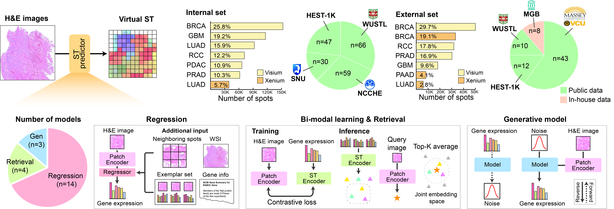

# STP-Bench: A Unified Systematic Benchmark for Virtual Spatial Transcriptomics from Histopathology Images

[](https://www.python.org/downloads/release/python-3110/)
[](https://huggingface.co/datasets/nexgem/STP-Bench)
[](https://creativecommons.org/licenses/by-nc-sa/4.0/)

STP-Bench is a benchmark suite for **virtual spatial transcriptomics** — predicting
spot-level gene expression directly from H&E histopathology images. It provides a
single, unified `STPred` API to preprocess data, train, and evaluate a growing
collection of published models under matched **internal cross-validation** and
**external-dataset** evaluation protocols, so results stay directly comparable
across models and datasets.



Most models plug into a shared, swappable **patch encoder** (`DATA.model_name`,
default `uni_v2`) and only differ in the **downstream architecture** built on
top of its embeddings — the benchmark deliberately keeps that encoder fixed
across those models so performance difference reflects architecture,
not "which foundation model happened to extract its features." A smaller set
of models bring their own internal image encoder instead (a custom CNN/ViT
backbone baked into the model class, or a zero-shot pretrained model) and sit
outside that comparison axis — see
[Configuration](#configuration) below for which is which.

## Updates

- **2026-08-22** — Added **AsymST**, an asymmetric dual-pathway (DenseNet-121 + UNI2-h ViT cross-attention fusion) model with its own internal image encoder (`feature_type: none`) rather than the shared patch-encoder pipeline.
- **2026-07-17** — Added **DeepSpotM** as a new zero-shot pretrained model.
- **2026-05-28** — Initial release.

## Installation

```bash
git clone https://github.com/NEXGEM/STP-Bench.git
cd STP-Bench
bash scripts/create_env.sh
source .stpbench/bin/activate
```

<details>
<summary><strong>Installation details</strong> (CUDA extras, manual setup, compatibility)</summary>

The setup script creates a Python 3.11 virtual environment and installs:

- editable `stp_bench`
- `torch==2.3.1+cu118`
- `torchvision==0.18.1+cu118`
- `torchaudio==2.3.1+cu118`
- runtime benchmark dependencies
- preprocessing dependencies
- `flash-attn==2.5.9.post1` *(optional — only needed for models that use Flash Attention)*

To skip `flash-attn`:

```bash
SKIP_FLASH_ATTN=1 bash scripts/create_env.sh .stpbench
```

If you do install `flash-attn`, use the pinned PyTorch/CUDA stack above to
ensure a compatible prebuilt wheel is available.

#### Optional CUDA Extras

CUDA dataframe extras are not required for the core benchmark API. Install them
only on machines where RAPIDS CUDA 12 packages are supported:

```bash
INSTALL_CUDA_EXTRAS=1 bash scripts/create_env.sh .stpbench
```

#### Manual Setup

Use this only if you do not want the setup script:

```bash
uv venv --python 3.11 .stpbench
source .stpbench/bin/activate

python -m pip install --upgrade pip setuptools wheel packaging ninja
uv pip install -r requirements/torch-cu118.txt
uv pip install -e .
uv pip install -r requirements/runtime.txt
uv pip install -r requirements/preprocess.txt

# Optional: only needed for models that use Flash Attention
uv pip install -r requirements/flash-attn.txt --no-build-isolation
```

`requirements/all.txt` contains the pinned torch stack plus runtime and
preprocessing dependencies:

```bash
uv pip install -e .
uv pip install -r requirements/all.txt

# Optional: only needed for models that use Flash Attention
uv pip install -r requirements/flash-attn.txt --no-build-isolation
```

#### Compatibility Contract

The supported default environment is:

- Linux x86_64
- Python 3.11
- Ubuntu 20.04 / `glibc 2.31` or newer
- PyTorch `2.3.1+cu118`
- TorchVision `0.18.1+cu118`
- FlashAttention `2.5.9.post1` *(optional)*

Check for accidental mismatch:

```bash
python -c "import torch; print(torch.__version__, torch.version.cuda)"
python -c "import flash_attn; print(flash_attn.__version__)"  # optional
```

If installing `flash-attn`, avoid mismatched environments such as:

- `torch==2.10.0+cu128` with a CUDA 11.7 local toolkit.
- `flash-attn==2.8.3` on Ubuntu 20.04 / `glibc 2.31`.

Those combinations have no reliable local `flash-attn` install path in this
project. Use the pinned requirements above instead.

</details>

## Benchmark Data

Preprocessed benchmark data (patches, ST expression, embeddings, metadata) is
hosted on Hugging Face at [`nexgem/STP-Bench`](https://huggingface.co/datasets/nexgem/STP-Bench).

```python
from huggingface_hub import snapshot_download

local_dir = snapshot_download(
    repo_id="nexgem/STP-Bench",
    repo_type="dataset",
    local_dir="/path/to/stp_bench",
)
```

Set the downloaded directory as `DATA.data_dir` (and `preprocess.output_dir`) in
your data config.

<details>
<summary><strong>Data download and layout details</strong> (CLI download, directory structure)</summary>

#### Download via CLI

```bash
huggingface-cli download nexgem/STP-Bench \
    --repo-type dataset \
    --local-dir /path/to/stp_bench
```

#### Use as `data_dir`

```yaml
DATA:
  data_dir: /path/to/stp_bench   # root of the downloaded HF dataset

preprocess:
  input_dir: /path/to/stp_bench
  output_dir: /path/to/stp_bench
```

The expected directory layout after download:

```
stp_bench/
├── patches/          # patch .h5 files per sample
├── st/               # aligned expression .h5ad files per sample
├── emb/              # pre-extracted patch embeddings (if included)
├── metadata/         # per-sample JSON metadata (HEST format)
└── wsis/             # whole-slide images (if included)
```

</details>

## Quick Start

> Requires the benchmark data downloaded and `DATA.data_dir` set as above —
> running this against the bundled `ncche/xenium` / `hest/LUAD` configs
> as-is (with their placeholder paths) will fail `stp.check(..., strict=True)`
> with a list of missing files.

> When working directly from the repository without installing the package, use
> `from api import STPred` with `src/` on `PYTHONPATH`.

```python
from stpbench import STPred

stp = STPred(
    models=["StNet"],
    gpu=1,
    repo_root="/path/to/repo",  # path where config files exist
)

stp.check(data="ncche/xenium", strict=True)          # validate before a heavy run
result = stp.benchmark(internal_data="ncche/xenium", external_data="hest/LUAD")

print(result.summary())
result.save("benchmark_results.csv")
```

Config names map exactly to YAML files (`config/data/ncche/xenium.yaml`,
`config/model/StNet.yaml`, ...). If a file is missing, `STPred` raises an error
with the exact path to create.

For the full `STPred` reference (constructor parameters, running each stage
separately, resuming a run, persisting/restoring state, discovery helpers),
see **[docs/guide.md](docs/guide.md)**.

## Python API

Primary workflow methods, one line each — see
**[docs/guide.md — Core Workflow](docs/guide.md#core-workflow)** for full
parameter references and examples of every one of these:

- `stp.check(data, strict=False)`: validate configs and expected artifacts before a heavy run.
- `stp.preprocess(data, dry_run=False)`: prepare one dataset for all selected models.
- `stp.train(data=None)`: train all selected models.
- `stp.evaluate_internal(data=None)` / `stp.evaluate_external(data, train_data=None)`: evaluate on internal test folds, or a labeled external dataset.
- `stp.benchmark(internal_data, external_data=None)`: preprocess, train, internal evaluate, and optionally external predict/evaluate, in one call.
- `stp.predict(data, train_data=None, ...)`: predict on slide-image-only data — a named config, or (see [Easy Inference Directly on a WSI](docs/guide.md#easy-inference-directly-on-a-wsi)) a bare WSI file/directory/asset dir with no config to write.
- `stp.visualize(gene, sample, ...)`: render a predicted gene's expression for one sample on the slide's own thumbnail. See [Visualizing a Prediction](docs/guide.md#visualizing-a-prediction).

Every workflow method above returns a `BenchmarkResult` (dict-compatible,
`.summary()`, `.to_dataframe()`, `.save("results.csv")`, ...) — see
[docs/guide.md — Result Objects](docs/guide.md#result-objects). Logging
(`verbose`, `log_file`) and W&B tracking (`wandb`, `wandb_project`) are
constructor options — see
[docs/guide.md — Creating an STPred Instance](docs/guide.md#creating-an-stpred-instance).

## Configuration

`STPred` uses exact-name YAML files under `config/data/` and `config/model/`.
A data config must define at minimum:

```yaml
GENERAL:
  seed: 2021
  log_path: ./logs

TRAINING:
  num_k: 5
  learning_rate: 1.0e-4
  num_epochs: 200
  monitor: PearsonCorrCoef
  mode: max
  early_stopping: {patience: 20}
  lr_scheduler: {patience: 5, factor: 0.1}

DATA:
  data_dir: /path/to/processed_data
  dataset_name: STDataset
  gene_type: hmhvg
  num_genes: 200
  num_outputs: 200
  model_name: uni_v2          # patch encoder — see note below
  train_dataloader: {batch_size: 128, num_workers: 4, pin_memory: false, shuffle: true}
  test_dataloader:  {batch_size: 1,   num_workers: 4, pin_memory: false, shuffle: false}

preprocess:
  mode: raw                   # raw | stpbench
  input_dir: /path/to/raw_data
  output_dir: /path/to/processed_data
```

`DATA.model_name` selects the **patch encoder** used to pre-extract patch
embeddings — a choice that's independent of, and swappable separately from,
each model's own downstream architecture (`config/model/<Model>.yaml`).
Leave it at the default, `uni_v2`, unless you have a specific reason to
change it: every model that consumes pre-extracted embeddings
(`feature_type: global/neighbor/target/all`) is benchmarked against the
*same* encoder, which is what makes their scores comparable as an
architecture comparison in the first place — changing it for only some
models would conflate "better architecture" with "better patch encoder."
A minority of models bypass this shared encoder entirely, either because
they build their own image encoder into the model class (`feature_type:
none`, e.g. a custom CNN/ViT backbone) or because they're zero-shot
foundation models with a fixed pretrained backbone (e.g. DeepSpotM). Those
aren't on the same comparison axis and shouldn't be read as "architecture X
beats architecture Y" against `uni_v2`-encoder models — see
[docs/guide.md — Adding a New Model](docs/guide.md#adding-a-new-model) for
how a new model's config should flag which category it falls into.

Use `STPred.init_data_config("my_data")` to generate an editable template.
All relative paths in configs (`meta_dir`, `log_path`, `output_dir`) are
resolved relative to the `repo_root` passed to `STPred(...)` — see
[docs/guide.md — Creating an STPred Instance](docs/guide.md#creating-an-stpred-instance)
for that and every other constructor parameter.

## Outputs

Default locations (can be changed in the data config YAML):

- Logs: `<GENERAL.log_path>/<data>/<model>/<timestamp>/`
- Checkpoints: `<GENERAL.log_path>/<data>/<model>/<timestamp>/fold<k>/`
- Predictions (eval): `<DATA.output_dir>/<data>/<model>/fold<k>/`
- Predictions (inference): `<DATA.output_dir>/<data>/<model>/<train_data>/fold<k>/`

For a WSI-path `predict()` call (see [docs/guide.md](docs/guide.md#easy-inference-directly-on-a-wsi)),
`output_dir` doubles as the patch/embedding root: patches/embeddings land at
`<output_dir>/patches/`, `<output_dir>/emb/`, and predictions nest under
`<output_dir>/_wsi_predict/predictions/<model>/<train_data>/fold<k>/` —
no per-slide directory, since `output_dir` is commonly reused across
separate calls on different slides and samples are already distinguished by
their own `<sample>.h5ad` filename. Provenance manifests land one level up,
one per sample: `<output_dir>/_wsi_predict/manifests/<sample>.yaml`.

## Extending STP-Bench

STP-Bench doesn't ship model implementations or raw datasets — you bring your
own. The easiest way to provide either is to point at wherever it already
lives:

- **Model code**: a local path to an existing implementation, or a git/
  GitHub URL to clone. A reference implementation (or its pretrained
  weights) lets the integration match the real input/output shapes instead
  of guessing from a paper description.
- **Raw data**: a local path to the per-sample WSI/ST directories (most
  datasets are already sitting on the same machine or shared storage —
  too large to move casually), or a download URL/accession (HuggingFace
  dataset repo, GEO/SRA/Zenodo, cloud bucket) if it isn't local yet.
- **Extra preprocessing** (only if the model needs it — graph construction,
  similarity matrices, custom patch sampling, etc.): STP-Bench does not
  write this for you either. Bring the preprocessing logic along with the
  model code (it's usually already part of the reference implementation)
  so it can be adapted into `src/model/<module_name>/preprocess/`.

With that in hand:

- **Adding a new dataset** — see **[docs/guide.md — Adding a New Dataset](docs/guide.md#adding-a-new-dataset)**.
- **Adding a new model** — see **[docs/guide.md — Adding a New Model](docs/guide.md#adding-a-new-model)**.

#### For Claude Code

This repository ships [Claude Code](https://claude.com/claude-code) skills
that encode the procedures above as agent-actionable checklists — see
[docs/guide.md — Claude Code Skills](docs/guide.md#claude-code-skills).

## License

Released under [CC BY-NC-SA 4.0](LICENSE.md) — non-commercial use with attribution, and derivatives must be shared under the same license.

## Citation

<!-- TODO: add citation once the paper is on arXiv -->
```
@article{stpbench2026,
  title={STP-BENCH: A Unified Systematic Benchmark for Virtual Spatial Transcriptomics from Histopathology Images},
  author={...},
  journal={...},
  year={2026}
}
```
