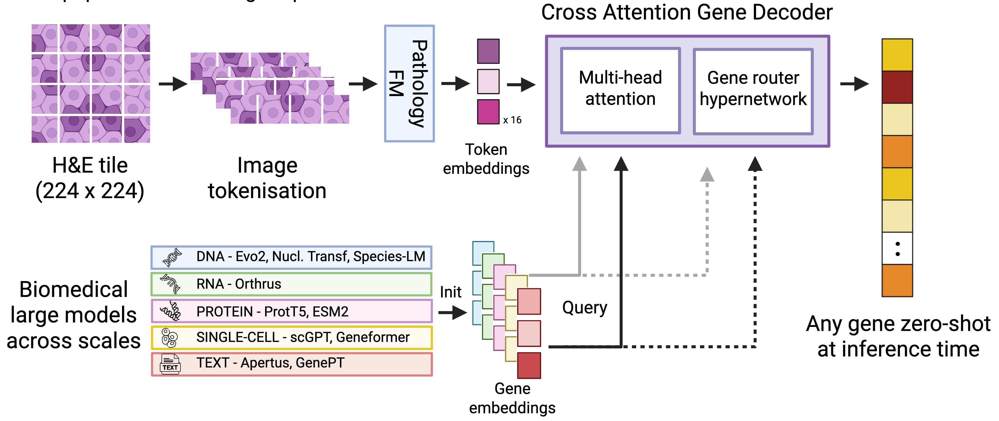

# DeepSpot-M

**DeepSpot-M: a multimodal foundation model for transcriptome-wide virtual spatial transcriptomics from histology.**

[](LICENSE)
[](https://www.python.org/downloads/)
[](https://www.medrxiv.org/content/10.64898/2026.06.19.26356060v1)
[](https://huggingface.co/ratschlab/DeepSpotM)
[](https://huggingface.co/datasets/ratschlab/TCGA_virtual_spatial_transcriptomics_atlas)
[](https://huggingface.co/datasets/ratschlab/HEST_Xenium_virtual_spatial_transcriptomics)

DeepSpot-M was developed by Kalin Nonchev, Sebastian Dawo, Karina Silina, Viktor Hendrik Koelzer, and Gunnar Rätsch.

DeepSpot-M is a multimodal foundation model that maps a histology image tile to
spatial gene expression. It tokenises a 224x224 H&E tile with a LoRA-adapted
pathology foundation backbone (Midnight) and lets each gene query attend to the
patch tokens through a cross-attention gene decoder. A gene router hypernetwork
generates gene-specific output projections from frozen biological embeddings drawn
from DNA, RNA, protein, single-cell and text foundation models (Evo 2, Orthrus,
ProtT5, scGPT, Apertus). Because genes are represented as queryable embeddings
rather than fixed outputs, one model predicts transcriptome-wide expression and
genes it never saw during training.

The preprint is available [here](https://www.medrxiv.org/content/10.64898/2026.06.19.26356060v1).



**Fig. DeepSpot-M predicts transcriptome-wide spatial gene expression from histology.**
A 224x224 H&E tile is tokenised into spatial patch embeddings by a LoRA-adapted
pathology foundation model. A cross-attention gene decoder lets each gene query
independently attend to patch tokens via multi-head attention, and a gene router
hypernetwork generates gene-specific output projections from frozen biological
embeddings drawn from DNA, RNA, protein, single-cell and text foundation models.
This design enables zero-shot prediction of genes at inference time.

> ⚠️ **Research use only. Not for clinical or diagnostic use.**

## Install

```bash
pip install deepspotm           # from PyPI (when published)
# or
pip install git+https://github.com/ratschlab/DeepSpotM.git
```

## Usage

```python
from deepspotm import DeepSpotM

# Loads config.json + model.safetensors + tokens.csv from the HF repo.
# The Midnight backbone is built offline from a bundled config and its
# weights come from the checkpoint, so no network access to kaiko-ai/midnight.
model, image_processor = DeepSpotM.from_pretrained(
    "ratschlab/DeepSpotM",
    source="scgpt",   # one of evo2, orthrus, prott5, scgpt, apertus
)

import torch
tile = image_processor(my_pil_tile).unsqueeze(0)   # 224x224 H&E tile
with torch.no_grad():
    expression, _, _ = model(tile)                 # (1, n_genes)

# Map the output vector to gene symbols (column i is model.gene_names[i]).
preds = dict(zip(model.gene_names, expression.squeeze(0).tolist()))
```

The model predicts the ~19k-gene panel in `tokens.csv`, ordered by
`model.gene_names`, so output column `i` is `model.gene_names[i]`.
`from_pretrained` also accepts a local directory containing the three files.

To predict only specific genes, pass them to `predict_genes`. This is faster because
only those gene queries are computed.

```python
vals = model.predict_genes(tile, ["EPCAM", "CD3D", "PTPRC"])   # (1, 3)
vals = model.predict_genes(tile, "EPCAM")                       # (1, 1)
```

Predicting genes outside this panel requires regenerating the source gene embeddings
and is not part of this release.

### Command line

Most users start from a whole-slide image.
[`examples/predict_wsi.py`](examples/predict_wsi.py) reads a slide, tiles it on a
224-px grid at native (~20x) resolution, drops background, predicts per tile, and
writes a spatial AnnData (`.h5ad`) — the same format as the TCGA atlas, ready for
scanpy / squidpy. It needs `pyvips` and `anndata` (`pip install pyvips anndata`).

```bash
# one slide -> one .h5ad (full ~19k-gene panel)
python examples/predict_wsi.py slide.svs -o slide.h5ad

# a folder of slides -> one .h5ad each, scoring three marker genes
python examples/predict_wsi.py slides/ -o out/ --genes BRAF CD37 COL1A1
```

For already-cut 224x224 tiles, [`examples/predict.py`](examples/predict.py) scores a
single tile or a folder of tiles and prints the top genes per tile or writes a CSV:

```bash
python examples/predict.py tile.png --genes BRAF CD37 COL1A1
```

Run either script with `--help` for the full options (`--source`, `--genes`,
`--device`, background filtering, and more).

## Tutorial

[`examples/predict_tcga_skcm.ipynb`](examples/predict_tcga_skcm.ipynb) runs
DeepSpot-M end to end on a whole-slide TCGA-SKCM H&E image. It downloads an
open-access slide, tiles it into 224x224 patches, predicts BRAF, CD37 and COL1A1,
and overlays the predictions on the tissue, reproducing the example shown in the
[TCGA virtual spatial transcriptomics atlas](https://huggingface.co/datasets/ratschlab/TCGA_virtual_spatial_transcriptomics_atlas).

The published atlas predictions for the trained cancer types, melanoma among them,
used cancer-specific finetuned models. The tutorial uses the base released model in
zero-shot mode, so its maps look softer than the finetuned atlas.

## TCGA virtual spatial transcriptomics atlas

We applied DeepSpot-M to TCGA and released a virtual spatial transcriptomics atlas of
28,664 whole-slide images across 32 cancer types, with 295.3 million spots from
10,865 patients. The data lives at
[ratschlab/TCGA_virtual_spatial_transcriptomics_atlas](https://huggingface.co/datasets/ratschlab/TCGA_virtual_spatial_transcriptomics_atlas).

Each sample is a gzip-compressed AnnData stored as
`data/<cancer>/<FF|FFPE>/<slide_id>.h5ad.gz`. `X` holds the predicted log1p-CPM
expression over the full transcriptome, and `metadata.csv` lists every sample with
its cancer type, slide type and number of spots.

The dataset is gated, so request access and log in first.

```python
from huggingface_hub import login, snapshot_download
login(token="YOUR_HF_TOKEN")

repo = "ratschlab/TCGA_virtual_spatial_transcriptomics_atlas"

# one melanoma cohort (fresh-frozen and FFPE)
snapshot_download(repo, repo_type="dataset", local_dir="TCGA_data",
                  allow_patterns="data/TCGA_SKCM/*")

# all FFPE slides across every cancer type (use "data/*/FF/*" for fresh-frozen)
snapshot_download(repo, repo_type="dataset", local_dir="TCGA_data",
                  allow_patterns="data/*/FFPE/*")

# the whole atlas (large)
snapshot_download(repo, repo_type="dataset", local_dir="TCGA_data")
```

The dataset card shows how to load a sample and overlay predicted genes on the H&E.
We also release virtual single-cell Xenium profiles for the 59 HEST-1K samples at
[ratschlab/HEST_Xenium_virtual_spatial_transcriptomics](https://huggingface.co/datasets/ratschlab/HEST_Xenium_virtual_spatial_transcriptomics).

## Resources

- Model, [ratschlab/DeepSpotM](https://huggingface.co/ratschlab/DeepSpotM)
- TCGA virtual spatial transcriptomics atlas of 28,664 slides across 32 cancers, [ratschlab/TCGA_virtual_spatial_transcriptomics_atlas](https://huggingface.co/datasets/ratschlab/TCGA_virtual_spatial_transcriptomics_atlas)
- HEST-1K virtual single-cell Xenium profiles for 59 samples, [ratschlab/HEST_Xenium_virtual_spatial_transcriptomics](https://huggingface.co/datasets/ratschlab/HEST_Xenium_virtual_spatial_transcriptomics)

## Licenses

This project uses a split license.

- Code, [PolyForm Noncommercial 1.0.0](LICENSE). Non-commercial use only.
- Model weights, [CC-BY-NC-SA-4.0](WEIGHTS_LICENSE). Non-commercial, ShareAlike, with
  attribution.

See [THIRD_PARTY_LICENSES.md](THIRD_PARTY_LICENSES.md) for the backbone and
gene-embedding sources, all MIT or Apache-2.0.

## Citation

DeepSpot-M: a multimodal foundation model for transcriptome-wide virtual spatial
transcriptomics from histology
([medRxiv, 2026](https://www.medrxiv.org/content/10.64898/2026.06.19.26356060v1)).

```bibtex
@article{nonchev2026deepspotm,
  title={DeepSpot-M: a multimodal foundation model for transcriptome-wide virtual spatial transcriptomics from histology},
  author={Nonchev, Kalin and Dawo, Sebastian and Silina, Karina and Koelzer, Viktor Hendrik and Raetsch, Gunnar},
  journal={medRxiv},
  pages={2026--06},
  year={2026},
  publisher={Cold Spring Harbor Laboratory Press}
}
```

See also [CITATION.cff](CITATION.cff).

## Contact

For questions, please get in touch with [Kalin Nonchev](https://bmi.inf.ethz.ch/people/person/kalin-nonchev).
